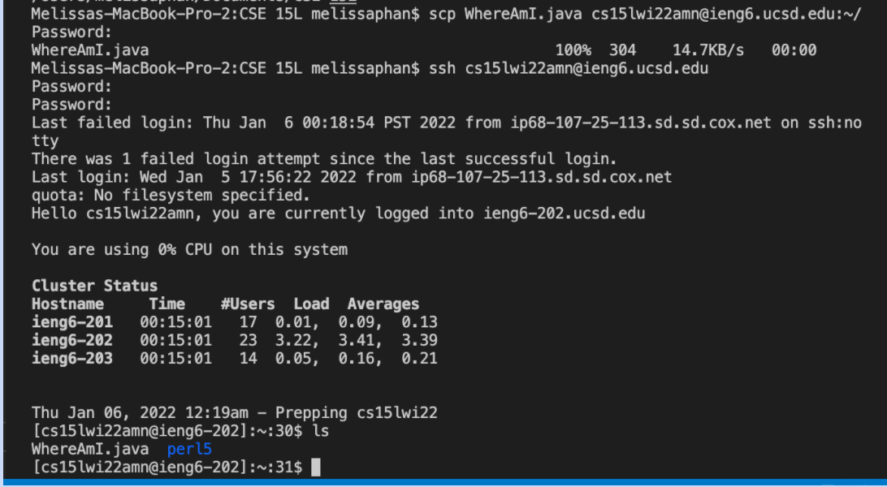

# How to Log Into a Course-Specific Account on `ieng6`:

## Step 1: Installing Visual Studio Code


 - Vistual Studio Code is a free coding editor that supports any programming languages without switching editors.

  - To install VS Code, visit the website [https://code.visualstudio.com/](https://code.visualstudio.com/) and download the version of program that correctly corresponds to your operating system. When installed, the opening window will look like this.


## Step 2: Remotely Connecting


- In order to connect to a remote computer host, we  have to look up our course-specific account for CSE15L on the website: [https://sdacs.ucsd.edu/~icc/index.php](https://sdacs.ucsd.edu/~icc/index.php). Your course-specific account should be similar to "cs15lwi22zz", with the last 3 characters being specific to your account.

- Next, we will open a terminal in VS Code by using Ctrl or Command + `, or use the Terminal --> New Terminal menu option.

- Enter the command, `ssh cs15lwi22zz@ieng6.ucsd.edu`, but replace the `zz` with your course-specific account.

- If this is the first time connecting to the server, a message may ask if you want to continue connecting to the remote host. Type `yes` and press enter, then enter your password. This process should look similar to picture presented below. The terminal is now connected to the remote server!


## Step 3: Trying Some Commands


- Try running some commands in different ways, both on your computer and on the remote computer after logging into your ssh. Here are some useful commands to try:

```
    cd ~
    cd 
    ls -lat
    ls -a
    ls <directory>
```
- Additionally, to log out of the remote server in your terminal you can type Ctrl-D or run the command `exit`.

## Step 4: Moving Files over SSH with scp

- `scp` is a command line that allows us to securely copy files and directories between computers when working remotely.

- First, we will create a new file called `WhereAmI.java` with the  following contents in it:

```
    class WhereAmI {
        public static void main(String[] args) {
            System.out.println(System.getProperty("os.name"));
            System.out.println(System.getProperty("user.name"));
            System.out.println(System.getProperty("user.home"));
            System.out.println(System.getProperty("user.dir"));
        }
    }
```
-  Next, in the terminal from the directory where we made the `WhereAmI.java` file, run the command with your course-specific account: 

```
scp WhereAmI.java cs15lwi22zz@ieng6.ucsd.edu:~/
```
- This command should be prompted for a password. Then, if we log into ieng6 with ssh again and use the command `ls`, the file can now be found in the home directory. We can now run it on the ieng6 computer using `javac` and `java`. 



## Step 5: Setting an SSH Key

- An `ssh` key is an access credential that is used when accessing the SSH protocol. Ultimately, `ssh` keys provides the user to securely access a remote computer without the need for a password. 

- To begin with, enter the command, `ssh-keygen`, which should prompt the message asking us to "Entire file in which to save the key". Using your username, enter the following path: "/Users/melissaphan/.ssh/id_rsa". 

- Proceed to follow the prompted messages should result in the following output: 


- By doing so, we have created two new files, the private key (in a file `id_rsa`) and the public key (in a file `id_rsa.pub`), which is now stored in the .ssh directory on your computer.

- Lastly, in order to copy the public key to `.ssh` directory on the user account on the server.

```
$ ssh cs15lwi22zz@ieng6.ucsd.edu
<Enter Password>
# now on server
$ mkdir .ssh
$ <logout>
# back on client
$ scp /Users/melissaphan/.ssh/id_rsa.pub cs15lwi22amn@ieng6.ucsd.edu :~/.ssh/authorized_keys
```
- We are now able to `ssh` and `scp` without entering your password. 


## Step 6: Optimizing Remote Running

- With ssh-keygen now established, we can try to make quicker and easier local edits to `WhereAmI.java`.

- Some examples include writting a command in quotes after an `ssh` command to run it directly on the remote server and then exit, such as: 
```
ssh cs15lwi22@ieng6.ucsd.edu "<command>"
```

- Additionally, we can separate multiple commands written on the same line with semicolons: 
```
cp WhereAmI.java OtherMain.java; javac OtherMain.java; java WhereAmI
```

- In order to cut down the amount of keystrokes required to make a local edit to WhereAmI.java, copy it to the remote server and run it, I used the commands: 

```
ssh cs15lwi22amn@ieng6.ucsd.edu 

cp WhereAmI.java OtherMain.java; javac OtherMain.java; java WhereAmI
```

- By using the up-key, I was able to access previously written commands, such as `ssh cs15lwi22amn@ieng6.ucsd.edu `, which used 2 keystroke (up-key + enter/return). Then, I copied the given command line, `cp WhereAmI.java OtherMain.java; javac OtherMain.java; java WhereAmI`, which allows me to run multiple commands within one line. This took 5 keystrokes to complete, command + c to copy and command + v to paste and enter/return. In total, 7 keystrokes were used to make a local edit. The result of the following commands ouputs the edit made to the WhereAmI.java file, which can be seen within the line `System.out.println("hello!");`.


