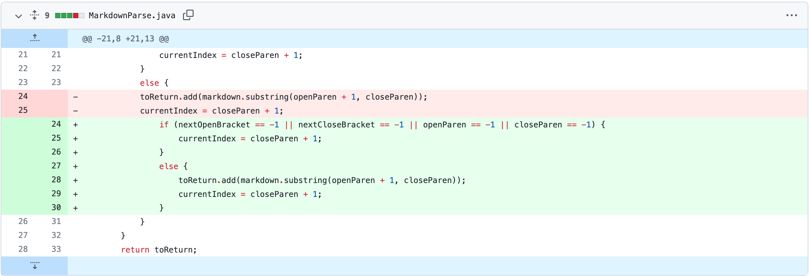
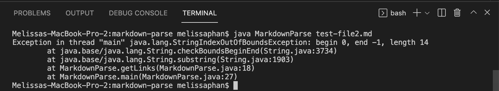

# Lab Report 2 (Week 4)

## Code Change 1: No Command Line Argument 

A problem we encountered occured when the program was not given an argument in the command line. The failure-inducing input that produced this error was the result of not including/referencing a test file when running the command, `java MarkdownParse`. Therefore, the bug in the program can be found in the main method when it tries to access `args[0]` when no test file was presented, resulting in the symptom that presented an `ArrayIndexOutOfBoundsException` error. This bug can be fixed with the addition of an `if-statement` that checks for an argument. 

**Link to file with failure-inducing input:** In this case, there is no test file that results in a failure-indicing input because the bug occurs when a test file argument is not passed in the command line. 

### Code Change from Github & Symptom

## Code Change 2: File With No Link

**Link to file with failure-inducing input:** [NoLink.md](https://github.com/memelissa/markdown-parse/blob/main/test-file2.md)

### Code Change from Github & Symptom

Another problem we accounted for occured when a test file did not contain any properly formatted links. In this case, the failure-inducing input was a file that simply contained no links. 
The symptom presented an `StringIndexOutofBoundsException `error which indicates that an index is either negative or greater than the size of the string. Instead, it should have returned an empty arraylist because there was no links found within the file. With this in mind, the bug in the given code might be referring to the inability of being able to idenitify missing brackets and parenthesis. This bug can be fixed with the addition of an `if-statement` that is used to catch the cases where empty files containing no links were given as an input. 

## Code Change 3: Image Links

**Link to file with failure-inducing input:** [BrokenImage.md](https://github.com/memelissa/cse15l-lab-reports/blob/main/BrokenImage.md)

### Code Change from Github & Symptom

The last problem occured when an link to an image was printed as an output, when this should not have occured when the given code is to return is expected to return website links. In this case, the failure-inducing input was a file containing an image link that was written in Markdown formate, which is often written as ` `. Therefore, the bug in the original code was able to identify the first and proceeding bracket, including the parentheses that contained the given url. The symption was the return of the link in the output. Lastly, a solution to the code was made through the utilization of conditional statements that checked if the character, "!", preceeded the first open bracket, allowing the code to ignore the image link. 

