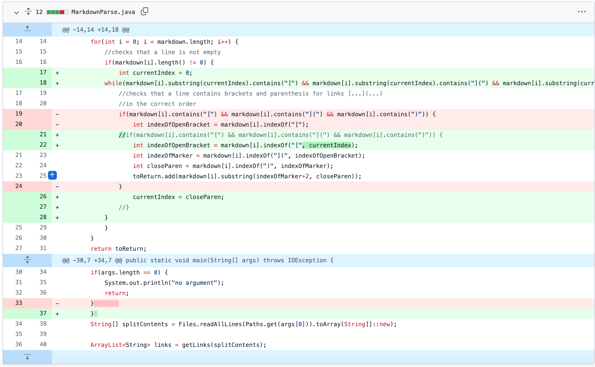

# Lab Report 2 (Week 4)

## Code Change 1: Multiple Links in the Same Line

A issue we encountered within

### Code Change Diff from Github Screenshot:

## Code Change 2: Broken Links

Another problem we encountered occured when the program was unable to read a broken link. The failure-inducing input consisted of a link that was incorrectly formatted and/or was not an actual working link. 

### Code Change Diff from Github Screenshot:

### [Link to Test File With Failure Inducing Input: brokenlink.md](https://github.com/memelissa/markdown-parse/blob/main/BrokenLink.md)

## Code Change 3: Image Links

The last problem we accounted for occured when an link to an image was printed as an output, when this should not have occured when the given code is to return is expected to return website links. In this case, the failure-inducing input was a file containing an image link that was written in Markdown formate, which is often written as ` `. Therefore, the bug in the original code was able to identify the first and proceeding bracket, including the parentheses that contained the given url. The symption was the return of the link in the output. Lastly, a solution to the code was made through the utilization of conditional statements that checked if the character, "!", preceeded the first open bracket, allowing the code to ignore the image link. 

**Link to failure-inducing input:** 

