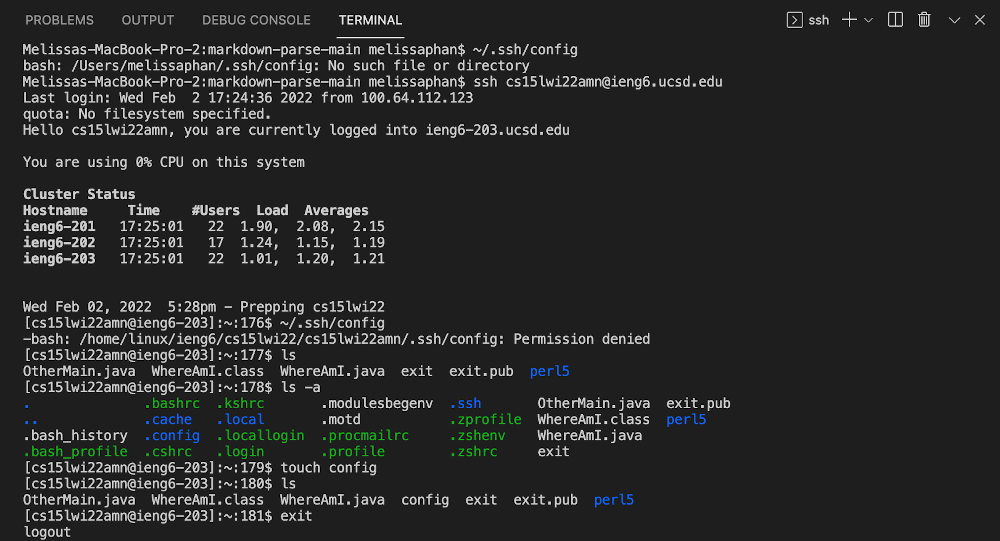
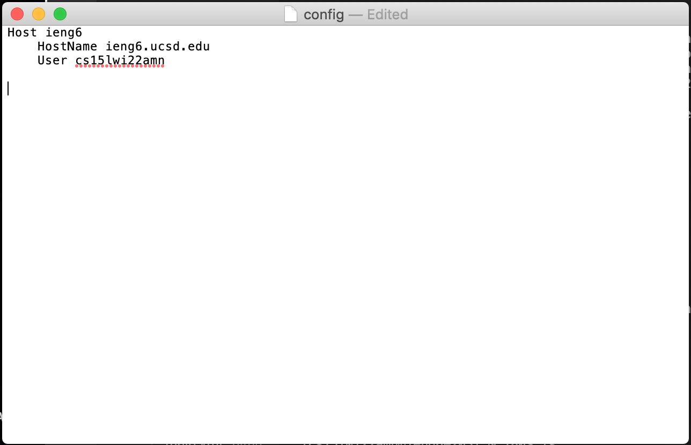
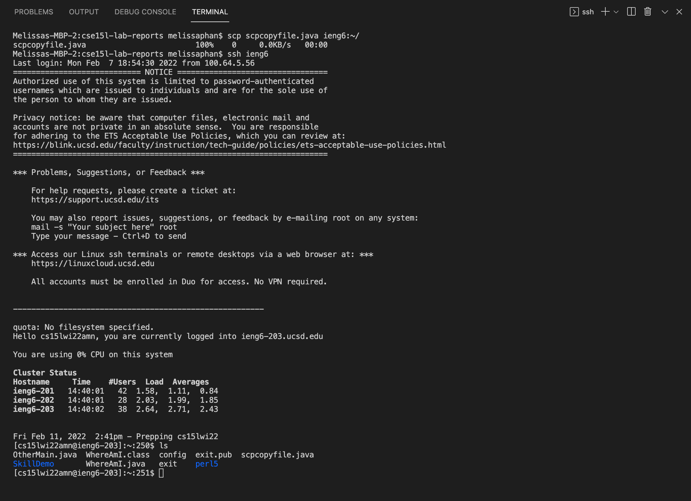

# Streamlining `ssh` Configuration

When logging into `ieng6` from your laptop by entering the following command: 

``` 
$ ssh cs15lwi22zzz@ieng6.ucsd.edu
```
In order to streamline the process of logging into `ieng6`, we can use `~/.ssh/config` to determine what username to use when logging into specific servers. 



In this case, we first had to perform the commands `ls-a` and `touch config` which allowed us to create a file without any content. By doing so, we then added lines that states your course-specific account username and the corresponding HostName that will be used when logging into the Host `ieng6`:

```
Host ieng6
    HostName ieng6.ucsd.edu
    User cs15lwi22zzz (use your username)
```

This series of actions will look something like this: 




Then, we must `touch ~/.ssh/config` and `open ~/.ssh/config` in order to run the command.

After now being able to run the command, `~/.ssh/config`, 
Lastly, we can run the command: 

``` 
ssh ieng6
```
By doing so, this will use the key and log you in with the given username we provided earlier using your public key.

A successfully perfomed login will be faster and easier to type, which should look something like this!:


Additionally, we can also utilize an scp command to copy a file to your account using just the alias. 

For this example, I created a file `scpcopyfile.java` in my computer and typed the command `scp scpcopyfile.java ieng6:~/`. This following command allows you to copy the file to the remote server. After logging into the server, running the command `ls` will show us that the file, `scpcopyfile.java` has successfully been copied into my account on the server.




