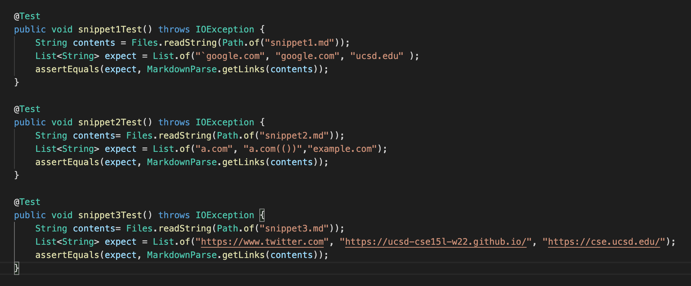
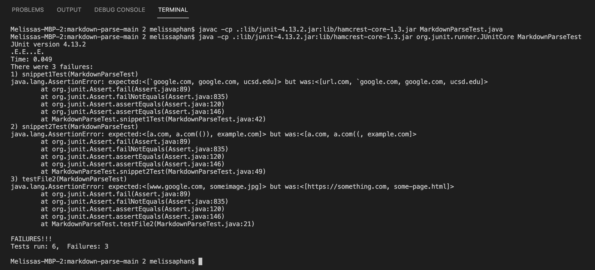

# Lab Report 4 (Week 8)

**Link to my MarkdownParse Repository:** [MarkdownParse Repository](https://github.com/memelissa/markdown-parse-main-2)

**Link to Group Reviewed MarkdownParse Repository:** [Group Reviewed MarkdownParse Repository](https://github.com/Stocktocon/markdown-parse)

## Expected Output for Each Snippet:

1. Snippet 1: ``["`google.com", "google.com", "ucsd.edu"]``

2. Snippet 2:``["a.com", "a.com(()), "example.com"]``

3. Snippet 3:``[https://www.twitter.com, https://ucsd-cse15l-w22.github.io/, https://cse.ucsd.edu/]``

## Code for Tests from MarkdownParse.java:

## JUnit Testing Output:

