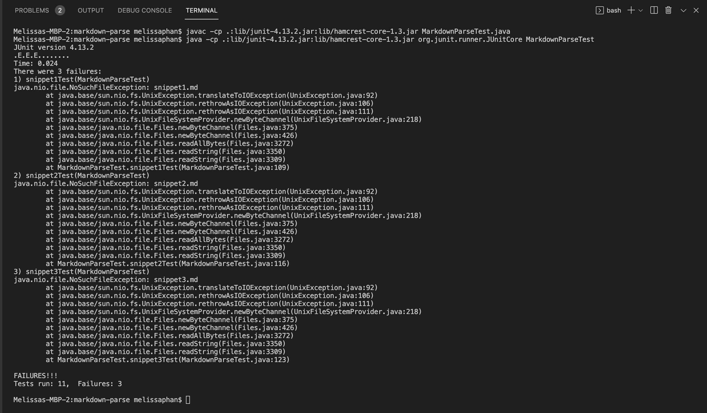

# Lab Report 4 (Week 8)

**Link to my MarkdownParse Repository:** [MarkdownParse Repository](https://github.com/memelissa/markdown-parse-main-2)

**Link to Group Reviewed MarkdownParse Repository:** [Group Reviewed MarkdownParse Repository](https://github.com/Stocktocon/markdown-parse)

## Expected Output for Each Snippet:

1. Snippet 1: ``["`google.com", "google.com", "ucsd.edu"]``

2. Snippet 2:`["a.com", "a.com(())", "example.com"]`

3. Snippet 3:`[https://www.twitter.com, https://ucsd-cse15l-w22.github.io/, https://cse.ucsd.edu/]`

## Code for Tests from my MarkdownParse.java:


## JUnit Testing Output:


The tests for Snippet1, Snippet2, Snippet3 failed, as seen within the terminal which states:
```
There were 3 failures:
1) snippet1Test(MarkdownParseTest)...
2) snippet2Test(MarkdownParseTest)...
3) testFile2(MarkdownParseTest)...
```
## JUnit Testing Output of Group Reviewed Repository:



The tests for Snippet1, Snippet2, Snippet3 failed, as seen within the terminal which states:
```
There were 3 failures:
1) snippet1Test(MarkdownParseTest)...
2) snippet2Test(MarkdownParseTest)...
3) testFile2(MarkdownParseTest)...
```

## Questions

1. Do you think there is a small (<10 lines) code change that will make your program work for snippet 1 and all related cases that use inline code with backticks? If yes, describe the code change. If not, describe why it would be a more involved change.

In regards to snippet 1, the code was unable to recognize the backticks within the given input. With this in mind, the issue could be resolved with a small (<10 lines)
code change, which would involve implementing code that would check for the index of the next occuring `. By determining the indexes of the backticks, we can check if the index of the next backtick is within two indexes of the first backtick to ensure that it will be dismissed. 

2. Do you think there is a small (<10 lines) code change that will make your program work for snippet 2 and all related cases that nest parentheses, brackets, and escaped brackets? If yes, describe the code change. If not, describe why it would be a more involved change.

For snippet 2, a small (<10 lines) code change can  account for parentheses, brackets, and escaped brackets. In this case, we may consider utilizing a while loop with an int variable that increments at every open bracket/parentheses and decreases in value with every close bracket/parentheses. If the count reaches or is greater than 1, the outer parantheses/brackets are ignored and the innor ones are treated as the links.


3. Do you think there is a small (<10 lines) code change that will make your program work for snippet 3 and all related cases that have newlines in brackets and parentheses? If yes, describe the code change. If not, describe why it would be a more involved change.


