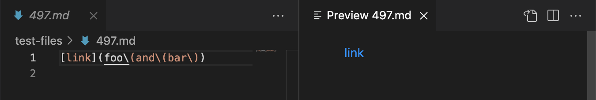
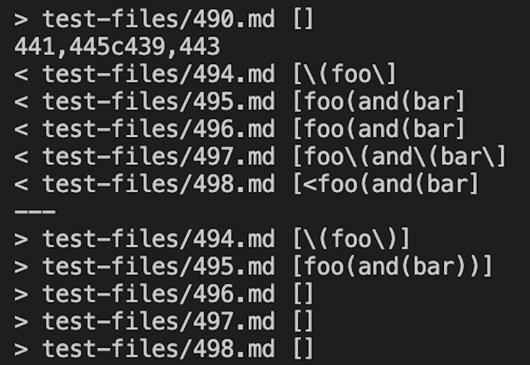
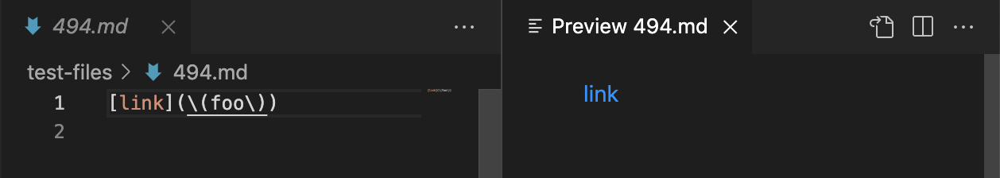
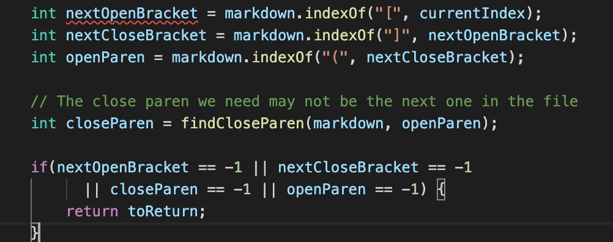

# Lab Report 5 (Week 10)

## How I Found the Test Differences

In order to find the tests with different results by using the command, `diff markdown-parse/out.txt MarkdownParse/results.txt`.  By using this command, it returns all the differences between `results.txt` of my `MarkdownParse.java` and results of the `markdown-parse` repository that was given to us.

## Test 1: File 497

### Preview Image Output:

### Output of Both Implementations:

For `test-files/497.md`, both of the implementations resulted in the incorrect output, with my implementation producing the output of `[foo\(and\(bar\]` and the other output being `[]`. The correct output should be `[[foo(and(bar)]`, therefore both implementations are wrong.  

### Bug in Code:

For the other implementation, an empty array is given as the output. The bug might be found in the `findCLoseParen` method, in which the code accounts for the opening and closing parantheses. In this case, the `openParenCount` remains positive despite being able to recognize the cloing parentheses, consequently returning an emoty array. An separate method can be added to independently identify the open and closing parantheses, so it doesnt affect the search for closing parantheses.

## Test 2: File 494

### Preview Image Output:

### Output of Both Implementations:

For `test-files/494.md`, both of the implementations resulted in the incorrect output, with my implementation producing the output of `[\(foo\]` and the other giving `[\(foo\)]`. The correct output should be `[(foo)]`, therefore both are wrong. 

### Bug in Code:

For my implementation, the bug in my code can be found when it is attempting to find the closing parentheses. As shown, the code will only find the first closing parantehses after the first opening parantheses, but fails to recognize multiple closing parantheses. The bug can be fixed with a change to the `openParen` and `closeParen`, and maybe a mathod that accounts for the values of each parantheses to ensure that each closing parantheses will be considered. 

