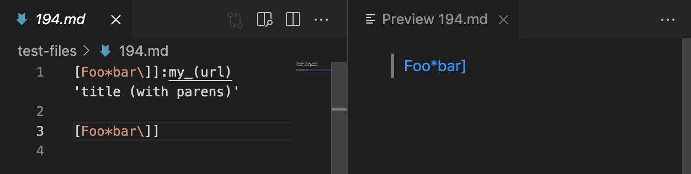

# Lab Report 5 (Week 10)

## How I Found the Test Differences

In order to find the tests with different results by using the command, `diff markdown-parse/out.txt MarkdownParse/results.txt`.  By using this command, it returns all the differences between `results.txt` of my `MarkdownParse.java` and results of the `markdown-parse` repository that was given to us.

## Test 1: File 194

### Preview Image Output:

## Test 2: File 494

### Preview Image Output:
